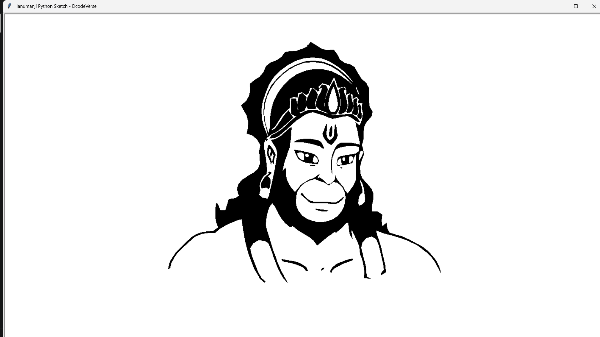

# 🕉️ Hanumanji Line-by-Line Sketch

<div align="center">



### A devotional artwork brought to life, one line at a time.


</div>

---

## ✨ Project Brief

**Hanumanji Line-by-Line Sketch** is a lightweight Python desktop experience that recreates a Hanumanji illustration as a smooth, fullscreen drawing animation. Instead of displaying a finished picture immediately, the program reads pre-generated coordinate paths and traces the artwork progressively across a clean white canvas.

Each path is drawn in two layers—a soft gray pencil guide followed by a crisp black line—to create a natural sketching effect. When every stroke is complete, the canvas transitions to the exact high-quality final artwork.

The project is built with Python, Tkinter, and Pillow. It runs locally, requires no internet connection after setup, and has no complex build process.

## 🌟 Features

- **Line-by-line drawing animation** — recreates the artwork from stored coordinate paths instead of using a simple image fade.
- **Dual-layer pencil effect** — combines a soft gray guide stroke with a sharp black finishing stroke.
- **Fullscreen presentation** — automatically fills the available display for an immersive experience.
- **Responsive artwork scaling** — preserves the original aspect ratio on different screen sizes.
- **Centered rendering** — keeps the artwork perfectly centered with calculated horizontal and vertical offsets.
- **Smooth curved strokes** — uses rounded caps, rounded joins, and Tkinter line smoothing.
- **Fast batched rendering** — processes multiple paths per frame to keep the animation fluid.
- **Exact final reveal** — replaces the sketch canvas with the original final image after the drawing completes.
- **Simple keyboard exit** — press `Esc` at any time to close the fullscreen window.
- **Offline and lightweight** — only Pillow is required beyond Python's standard desktop GUI toolkit.
- **Easy speed customization** — animation speed and stroke widths are controlled by clear constants in `main.py`.
- **One-click Windows launcher** — `run_windows.bat` installs Pillow and starts the app.

## 🎬 How It Works

```text
Launch application
       ↓
Load vector paths from data/paths.json
       ↓
Load and scale assets/final_output.png
       ↓
Draw gray guide + black line for each path
       ↓
Wait briefly after the final stroke
       ↓
Reveal the exact finished artwork
```

The JSON data stores the source canvas dimensions and a collection of point sequences. At runtime, each point is mapped from the source coordinate system to the current display size. This keeps the animated sketch aligned with the final image on any screen.

## 🚀 Quick Start

### Requirements

- Python 3.9 or newer
- Tkinter (normally included with Python on Windows and macOS)
- Pillow

### Windows — easiest method

Double-click:

```text
run_windows.bat
```

The launcher installs Pillow and opens the project automatically.

### Windows — terminal

```powershell
py -m pip install -r requirements.txt
py main.py
```

If the `py` launcher is unavailable, use `python` in both commands.

### macOS / Linux

```bash
python3 -m pip install -r requirements.txt
python3 main.py
```

> On some Linux distributions, Tkinter must be installed separately—for example, `sudo apt install python3-tk` on Ubuntu or Debian.

## 🎮 Controls

| Control | Action |
| --- | --- |
| `Esc` | Exit the fullscreen application |

The animation starts automatically after a short opening delay and reveals the final artwork automatically when complete.

## 📁 Project Structure

```text
hanumanji_line_by_line_final_output_project/
├── assets/
│   └── final_output.png   # Final Hanumanji artwork
├── data/
│   └── paths.json        # Source dimensions and drawing paths
├── main.py               # Animation and desktop UI
├── requirements.txt      # Python dependency list
├── run_windows.bat       # One-click Windows launcher
└── README.md             # Project documentation
```

## 🛠️ Built With

| Technology | Purpose |
| --- | --- |
| **Python** | Application logic and animation scheduling |
| **Tkinter** | Fullscreen window, canvas, and line rendering |
| **Pillow** | Loading and high-quality resizing of the final image |
| **JSON** | Portable storage for the pre-generated drawing paths |

## ⚙️ Customization

The main animation settings are near the top of `main.py`:

```python
PATHS_PER_FRAME = 3  # Higher values finish the sketch faster
FRAME_DELAY = 1      # Delay between batches in milliseconds
LINE_WIDTH = 1       # Width of the crisp black stroke
GUIDE_WIDTH = 2      # Width of the soft gray guide stroke
```

You can also change these values inside `draw_one_path()`:

- `#d6d6d6` — guide-stroke color
- `#050505` — final line color
- `900` in `self.root.after(900, self.final_reveal)` — pause before the final reveal

> Keep `data/paths.json` and `assets/final_output.png` paired. The stored paths use the source dimensions declared in the JSON file, so replacing only the image will not generate matching sketch lines.

## 🧠 Technical Highlights

- Uses `root.after()` for non-blocking animation rather than freezing the GUI with a loop.
- Calculates a single aspect-ratio-preserving scale for the final artwork.
- Independently maps source X and Y coordinates to the rendered image dimensions.
- Draws paths in small batches for a balance between speed and visible progression.
- Keeps a persistent `PhotoImage` reference so Tkinter does not discard the final image.
- Resolves asset paths relative to `main.py`, allowing the project to run from different working directories.

## 🔧 Troubleshooting

### `ModuleNotFoundError: No module named 'PIL'`

Install the project dependency:

```powershell
py -m pip install -r requirements.txt
```

### `python` is not recognized on Windows

Try the Windows Python launcher:

```powershell
py main.py
```

If neither command works, install Python from [python.org](https://www.python.org/downloads/) and enable **Add Python to PATH** during installation.

### The window opens but files are reported missing

Keep the original directory structure intact. In particular, confirm that these files exist:

```text
assets/final_output.png
data/paths.json
```

### The app is fullscreen and I cannot close it

Press `Esc`.

### Tkinter is missing on Linux

Install the Tk package supplied by your distribution, then run the app again. On Ubuntu or Debian:

```bash
sudo apt install python3-tk
```

## 💡 Ideas for Future Improvements

- Pause, resume, restart, and speed controls
- A visible drawing-progress indicator
- Optional background music or devotional audio
- Exporting the animation as a GIF or video
- A file picker for compatible artwork/path pairs
- Windowed and fullscreen display modes
- Configurable stroke colors and canvas themes

## 🙏 Acknowledgement

Created as a devotional coding project that combines art, animation, and Python.

<div align="center">

**Jai Shri Ram • Jai Hanuman**

Made with ❤️ and Python by **DcodeVerse**

</div>
